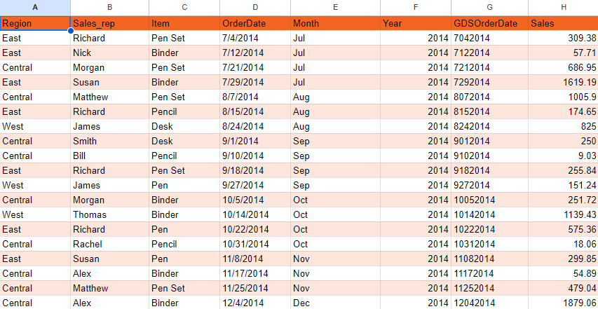
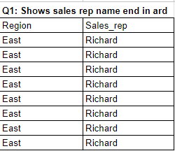

# SKILHARVEST-DATA-ANALYSIS-BOOTCAMP
My Skilharvest Data Analysis Journey

## INTRODUCTION
This repository is an archive of my learnings during the Data Analysis training bootcamp with SkilHarvest Academy.
The following below is the bootcamp contents:
1. Spreadsheets Fundamentals (Microsoft Excel & Google Sheets)
2. Github Fundamentals
3. Power Query
4. Introduction to Power BI
5. Capstone Project 1
6. Capstone Project 2
7. Power BI DAX Expressions

# 1.0 SPREADSHEETS FUNDAMENTALS
Spreadsheets are computer program that can capture, display and manipulate data arranged in rows and columns. They are very power tools used for organizing, analyzing, manipulating and presenting data.

Some of the applications for spreadsheets include but not limited to creating budget, maintaining records, creating business reports, forming graphs and charts for better understanding, doing long calculations, and analyzing data. Hence, understanding their features and capabilities can greatly enhance efficiency, producyivity and decision making processes.

- **Major Types**: Microsoft Excel and Google Sheet
- **Differences:**

| Features | Microsoft Excel | Google Sheet |
| ---------| ----------------| -------------|
| Ownership | Requires installation & licenses | Cloud-based, accessible online |
| Cost | Paid software, licenses required | Free basic features, paid options |
| Functionalities | Advanced data analysis tools | Basic to intermediate capabilities |
| Collaboration | Limited Collaboration features | Robust real-time collaboration capabilities |
| Operating System Required | Yes | No, only web browsers |

# 2.0 GITHUB FUNDAMENTALS
GitHub is a web-based platform that is used for version control. We learnt some its capabilities, which includes;
- Version Control
- Aids Collaboration
- Open Source

We learnt how to create a Github account, create repository and how to develop a Github project readme file

# 3.0 POWER QUERY
Power Query is a data transformation and preparation tool developed by Microsoft.

- **Data:** Data is information like facts, observations, perceptions, numbers, characters and image used to analyze something or make decisions

- **Information:** is a summary of the raw data. eg. positive or negative results that happen after some specific change.
- **Insight:** They are conclusions based on the results of information analysis. Meaningful business decisions are based on insight.

## *Google Query Functions*
Query functions are used to manipulate data in Google Sheets. They bring powerful, database-style searching to your spreadsheet so you can look up and filter your data in any format of your liking. Aggregation operations are also carried out on it.

*Query Function Syntax*
=QUERY(data,query,[headers])
The "=QUERY" has three (3) defined parameters:
- Data: The range of data that needs to be analyzed
- Query: The way data is processed, always enclosed in quotations
- Header: An optional number for when you need to indicate the number of header rows in your data

     # **Excerpt From The Datasheet**
   

# 3.1 POWER QUERY EXERCISES

1. Shows sales rep name end in "ard"
2.  Shows sales rep name end in "ew"
3.  Shows sales rep name start with "R"
4.  Show sales in Auguest and September
5.  Show the sum, count, min and max values of the data
6.  Show sales of items that ends with 'sk', include their region, sales rep and year
7.  Shows pen set and binder items
8.  Show sales of items that start with 'Pen', include their region, sales rep and year
9.  Show sales rep in East and Central in 2014 only

#                *Question 1 Solution*
```
PowerQuery
=QUERY(SkilHarvest_Stationary_Supplies!A1:H44, "select A,B WHERE B LIKE '%ard'", 1)
```


# 4.0 INTRODUCTION TO POWER BI
Power BI is a Data Visualization and Business Intelligence tool that converts data from different data sources to interactive dashboards and BI reports.

We were introduced to PowerBI interface and the processes of transforming data (Data Cleaning such as data extraction, column spliting).
We made use of two data sets for practices. Below are some of the amazing dashboard I created from the datasets.

# 5.0 CAPSTONE PROJECT 1: TEAM INSIGHTINNOVATORS

For the project, I was the team lead of team of 9 members and we were to undertake a data analytics project. The project was about carry out indepth analysis of the demographic and professional data collected from participants enrolled in the SkilHarvest Data Analysis Bootcamp 2024

I have created a separate GitHub project for this exercise: [View Project Here](https://github.com/Omiefa/SkilHarvest-Cohort2-Demography)

